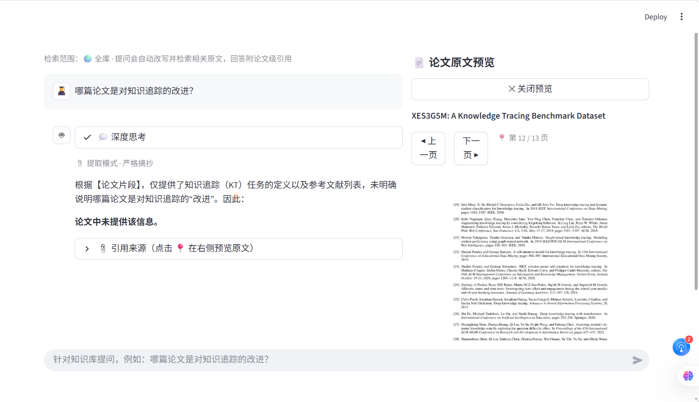

# PaperQA — 学术论文智能阅读助手

面向科研场景的 **RAG 问答系统**：上传论文 PDF，针对内容提问，返回**带原文引用的可溯源回答**，支持**多论文知识库**与跨论文提问。

- 🎯 解决「精读单篇论文约 2 小时、过半时间用于信息定位」的痛点
- 🔍 混合检索 + 查询改写 + 意图路由 + 重排 + 分级 Grounded 生成
- 📚 多论文持久化知识库（Qdrant + SQLite 注册表）
- 📎 回答附论文级引用，点击可定位到原文预览
- 🧪 内置评测框架（召回 / 准确率 / 引用正确率 / 三层归因）

---

## 🖼️ 系统预览

> 左：知识库问答（深度思考 + 论文级引用）；右：点击引用 📍 定位论文原文页面



---

## ✨ 功能特性

- **论文库管理**：批量上传、列表、删除、检索范围切换（全库 / 单篇），同名重传幂等覆盖更新
- **跨论文问答**：既能问单篇内容，也能问「哪篇论文做了 X」这类跨论文问题
- **可溯源回答**：每个论断标注 `[来源: 论文 / 第 N 页 / 片段 M]`，点击引用在右侧面板定位原文
- **意图路由**：自动区分「提取型」（严格摘抄）与「分析型」（允许有据推断，事实仍须溯源）
- **深度思考展示**：流式展示模型思考过程与最终回答
- **会话历史**：会话 token 标识，`?t=` 参数可恢复 / 分享对话
- **评测体系**：种子测试集 + LLM-judge + Bad Case 三层归因

---

## 🧠 系统架构

```
PDF 上传
   │
   ▼
PDF 解析 (PyMuPDF)
   │
   ▼
语义分块（段落聚合 · 800 token · 10% 重叠）
   │
   ▼
身份片段（标题 + 摘要，用于跨论文命中）
   │
   ▼
混合索引 ── 稠密向量 (qwen3.7-text-embedding) + BM25 全文检索（RRF 融合）
   │
   ▼
查询改写（多路查询） + 意图路由（提取 / 分析）
   │
   ▼
重排 (gte-rerank-v2)
   │
   ▼
Grounded / 分析双模式生成（带原文引用，流式输出）
```

## 🛠️ 技术栈

| 层 | 方案 |
|---|---|
| 界面 | Streamlit（聊天 + 原文预览面板） |
| PDF 解析 | PyMuPDF |
| 分块 | 段落聚合 + 800 token + 10% 重叠 |
| 检索 | 混合检索：百炼 `qwen3.7-text-embedding` 稠密向量 + BM25（RRF 融合）+ 查询改写 + 意图路由 |
| 重排 | `gte-rerank-v2`（DashScope 原生协议） |
| 生成 | OpenAI 兼容协议（DeepSeek / 百炼 Qwen / GLM / Kimi 等均可） |
| 向量库 | Qdrant（Docker） |
| 元数据 | SQLite 注册表（论文标题 / 页数 / 片段数 / MD5） |

---

## 🚀 快速开始

### 前置依赖

- Python 3.10+
- Qdrant 向量数据库（默认 `http://localhost:6333`）

```bash
# 启动 Qdrant（Docker）
docker run -p 6333:6333 -v qdrant_storage:/qdrant/storage qdrant/qdrant
```

### 安装

```bash
git clone https://github.com/gh-xiaoyong/PaperQA.git
cd PaperQA

python -m venv .venv
.venv\Scripts\activate          # Windows（macOS/Linux: source .venv/bin/activate）
pip install -r requirements.txt
```

### 配置密钥

```bash
copy .env.example .env          # Windows（macOS/Linux: cp .env.example .env）
```

编辑 `.env`，填入两个 key：

| 变量 | 说明 |
|---|---|
| `LLM_API_KEY` | 生成模型 key（DeepSeek / 百炼 Qwen 等 OpenAI 兼容平台） |
| `EMBEDDING_API_KEY` | 阿里云百炼向量 key（`qwen3.7-text-embedding`） |

> 也可运行 `python scripts/env_check.py` 体检 `.env` 结构（只显示变量名，绝不显示值）。

### 启动界面

```bash
streamlit run app.py
```

浏览器打开 `http://localhost:8501`，上传论文 PDF 即可提问。

---

## ⚙️ 配置说明（环境变量）

| 变量 | 默认值 | 说明 |
|---|---|---|
| `LLM_API_KEY` | — | 生成模型 key（**必填**） |
| `LLM_BASE_URL` | `https://api.deepseek.com` | OpenAI 兼容网关地址 |
| `LLM_MODEL` | `deepseek-chat` | 生成模型名 |
| `EMBEDDING_API_KEY` | — | 向量模型 key（混合检索**必填**） |
| `EMBEDDING_BASE_URL` | `https://dashscope.aliyuncs.com/compatible-mode/v1` | 向量接入点 |
| `EMBEDDING_MODEL` | `qwen3.7-text-embedding` | 向量模型名 |
| `EMBEDDING_DIM` | `1024` | 向量维度 |
| `RERANK_MODEL` | `gte-rerank-v2` | 重排模型 |
| `RERANK_BASE_URL` | （空） | 重排 API 根地址（默认经典公网） |
| `RETRIEVAL_MODE` | `hybrid` | `hybrid`=稠密+BM25；`bm25`=纯词法基线 |
| `DENSE_TOP_K` | `8` | 稠密检索候选数 |
| `RRF_K` | `60` | RRF 融合参数 |
| `REWRITE_ENABLED` | `1` | 查询改写开关 |
| `RERANK_ENABLED` | `1` | 重排开关 |
| `RERANK_POOL` | `8` | 重排候选池大小 |
| `INTENT_ROUTING_ENABLED` | `1` | 意图路由开关 |
| `ANALYTICAL_TOP_K` | `6` | 分析模式检索候选数 |
| `ANSWER_THINKING_LEVEL` | `low` | 思考档位：`low`=快 / `high`=`max`=深（留空=网关默认） |
| `LIBRARY_MODE` | `1` | `1`=论文库形态（多论文持久化）；`0`=单篇会话（评测用） |
| `QDRANT_URL` | `http://localhost:6333` | Qdrant 地址 |
| `QDRANT_COLLECTION` | `papers` | Qdrant 集合名 |

---

## 📖 使用指南

1. **入库**：侧边栏「批量上传论文 PDF」，一次最多 10 个、共 200MB；同名同内容重传自动跳过，同名内容变化则覆盖更新
2. **提问**：底部输入框提问，或点击示例问题；可在侧边栏切换「全库检索」或聚焦某篇
3. **看引用**：回答下方「引用来源」展示出处片段，点击 📍 在右侧面板定位原文页码
4. **会话**：左上「🆕 新对话」开启新会话；历史会话可随时切换恢复

---

## 🧪 评测

```bash
python scripts/run_eval.py                    # 跑种子测试集（12 题），出 Markdown 报告
python scripts/run_eval.py --limit 2          # 调试：只跑前 2 题
python scripts/run_eval.py --only A3,N2       # 只跑指定题目
python scripts/run_eval.py --resume           # 从检查点续跑
```

- **测试集**：`eval/testset.sample.json`（事实 / 对比 / 无答案 / 推理 四类）
- **指标**：检索召回 hit@k、回答准确率（LLM-judge）、引用有效率（机械）+ 支撑率（judge）、推断有据率（分析型）
- **归因**：Bad Case 三层归因 —— `retrieval`（证据未召回）/ `prompt`（证据在手未利用）/ `model`（证据在手仍错）
- **报告**：`eval/reports/report_*.md` + 原始明细 `results_*.json`

---

## 📁 项目结构

```
app.py                      # Streamlit 界面（聊天 + 论文预览）
paperqa/
  config.py                 # 配置与密钥（均从环境变量读取）
  llm.py                    # LLM 调用（OpenAI 兼容，流式）
  embeddings.py             # 百炼向量调用
  reranker.py               # gte-rerank 重排
  pdf_parser.py             # PDF 解析（PyMuPDF）
  chunker.py                # 语义分块
  retriever.py              # 混合检索（稠密 + BM25 / RRF，多路查询）
  vector_index.py           # 稠密向量索引（内存 numpy）
  vector_store.py           # Qdrant 向量库封装
  query_rewriter.py         # 查询改写 + 意图分类
  prompts.py                # Grounded Prompt + 分析模式 Prompt
  pipeline.py               # 端到端编排（意图路由）
  library.py                # 论文库（索引 / 注册 / 去重 / 删除）
  library_retriever.py      # 库级混合检索（BM25 从 payload 重建）
  history.py                # 会话历史持久化
  eval.py                   # 评测体系（三维指标 + 三层归因）
scripts/
  make_sample_pdf.py        # 生成示例论文（冒烟测试用）
  make_kt_paper.py          # 生成第二篇假论文（跨论文检索验证）
  smoke_test.py             # 命令行冒烟测试（含 --retrieval-only）
  env_check.py              # .env 结构体检（不显示值）
  probe_llm.py              # LLM 连通性探测
  run_eval.py               # 评测入口
  library_demo.py           # 论文库存储层验证
  merge_dups.py             # 按 MD5 合并重复条目
  repair_junk_titles.py     # 修复被页眉/版权行污染的标题
  repair_library_ids.py     # 重锚历史 paper_id
eval/
  testset.sample.json       # 种子测试集（12 题 × 4 类）
  reports/                  # 评估报告输出（生成产物，不入库）
data/
  sample/                   # 示例论文（演示 / 评测用）
  history/                  # 会话历史（运行时生成，不入库）
  library.sqlite3           # 论文注册表（运行时生成，不入库）
static/
  papers/                   # 上传论文 PDF 存档（运行时生成，不入库）
```

---

## 🔒 隐私与安全

- **密钥一律放 `.env`**，仓库只保留 `.env.example` 模板；`.env` 已被 `.gitignore` 排除，切勿 `git add -f .env`
- **上传的论文 PDF、会话历史、注册表** 均为本地运行时数据，已列入 `.gitignore`，不会随代码提交
- 提交前建议执行 `git status` 核对暂存清单，确认不含 `.env`、`*.pdf`、`data/`、`static/papers/` 等敏感文件

---

## 🗺️ 路线图

- [ ] 全库混合检索（BM25 从 payload 重建，已实现，待优化）
- [ ] 跨论文综合回答（多篇证据融合）
- [ ] 库管理 UI 增强（标签 / 分组 / 批量操作）
- [ ] 重排劣例治理，推断有据率纳入常规回归
- [ ] PDF 解析升级 MinerU / marker（双栏、公式）

---

## 📄 License

[MIT License](LICENSE) © 2026 Wang Yong
